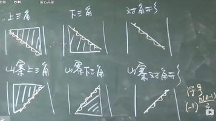
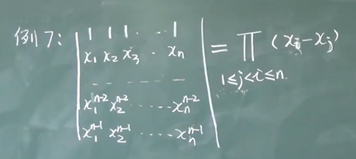
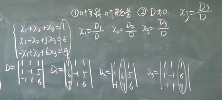
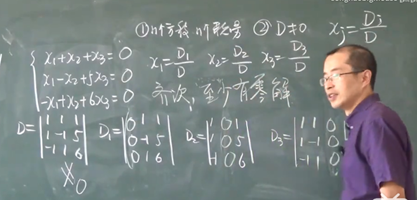
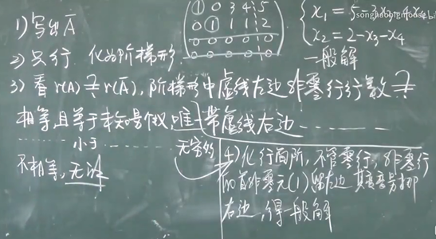
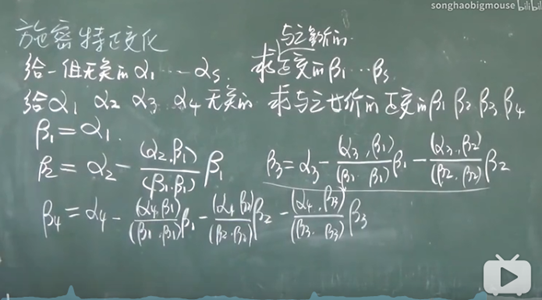
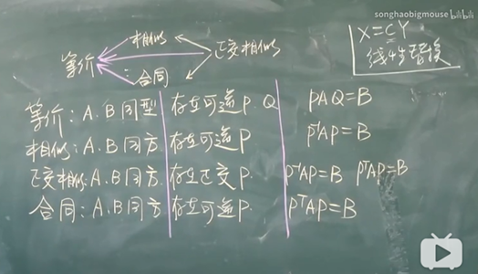
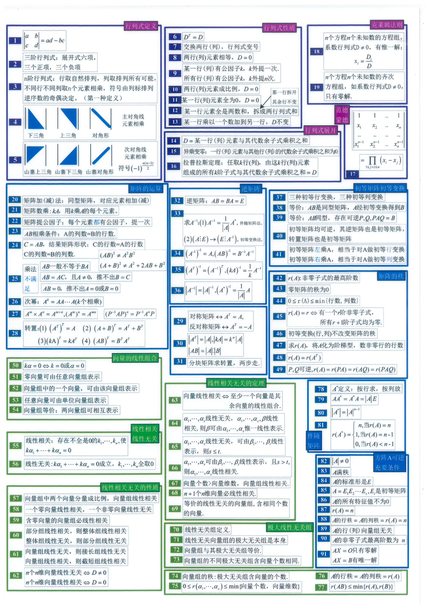
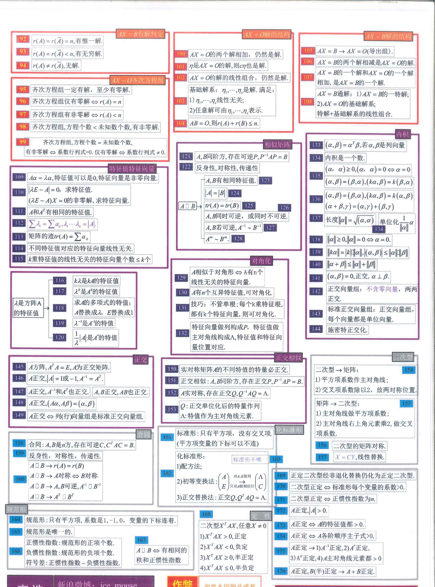

# Miao-A-SongHao-Linear-Algebra-Notes
bilibili 宋浩老师 “惊叹号” 系列 [《线性代数》网课](https://www.bilibili.com/video/av29971113) 笔记及时间点目录

# 💡 前言
- 我发现吧，线代没记笔记真不行。
- 浩浩学习，天天向上。数学网课强推[👍👍👍👍👍宋浩老师](https://space.bilibili.com/66607740)的**免费**视频，冲冲冲~~~
- 如有遗漏或错误欢迎推PR或发Issue~

# ⚗ 线性代数
1️⃣
2️⃣
3️⃣
4️⃣
5️⃣
6️⃣
7️⃣
8️⃣
9️⃣
## ☄ P1 二阶三阶行列式
### ⌚ 02:48 二阶行列式划线计算
- 行列式一定是方的
### ⌚ 15:00 三阶行列式划线计算
- 主对角线：╲
- 副对角线：╱
### ⌚ 22:29 N阶行列式预备知识
- 排列：1，2，……，n组成的一个有序数组叫n级排列，中间不能缺数
  - 如`3级排列：123，132，213，231，312，321`
- 逆序：大数排在小数前面
- 逆序数：逆序的总数
- 奇/偶排列：逆序数为奇/偶
- 标准排列：`123……N`
- 对换：交换排列中的两个数
  - 做一次对换，排列奇偶性改变
### ⌚ 24:21 名场面：宋浩抽取两名幸运观众提问
## ☄ P2 n阶行列式
### ⌚ 00:55 N阶行列式计算
- 按行展开：
  - 行标取标准排列
  - 列标取排列的所有可能，从不同行不同列取出n个元素相乘
  - 共有N!项
  - 每一项的符号由列标排列的奇偶性决定，偶正奇负
### ⌚ 20:50 下三角行列式
- 右上方三角形区域元素全部为0
- 下三角行列式 = 主对角线元素相乘
### ⌚ 23:14 上三角行列式
- 左下方三角形区域元素全部为0
- 上三角行列式 = 主对角线元素相乘
### ⌚ 24:40 对角线行列式
- 只有主对角线上有数
### ⌚ 25:30 副对角线行列式
- 副对角线行列式 = `(-1)^(n(n-1)/2) * 副对角线元素相乘`
### ⌚ 31:00 三角行列式总结

### ⌚ 31:09 行列式三种定义
- 1.按行展开，符号由列标排列决定
- 2.按列展开，符号由行标排列决定
- 3.胡乱展开，符号由行标排列逆序数和列标排列逆序数之和决定 `(-1)^(N(i1,i2,……,iN)+N(j1,j2,……,jN)), i：行标，j：列标`
## ☄ P3 行列式的性质
- 行列式对行成立的性质对列也成立
### ⌚ 00:25 性质一 转置
- 转置：把行按列写
- 行列式转置后值不变
- 行列式转置的转置等于本身
### ⌚ 11:48 性质二 两行互换
- 行列式两行互换，值变号
### ⌚ 20:38 性质三 两行相同
- 行列式两行相同，等于0
### ⌚ 23:10 性质四 行公因子k
- 行列式某行都乘以k，等于用k乘以这个行列式。即行列式某一行有公因子k，可往外提一次
- 若行列式所有元素都有公因子k，k外提N次
### ⌚ 28:05 性质五 两行成比例
- 行列式两行成比例，则行列式值为0
- 某一行全为0，则行列式为0
### ⌚ 34:20 性质六 和分解
- 若行列式某一行元素都可以表示为两项和，则行列式等于两个行列式相加
  ```python
  | 1+2 2+3 |   | 1 2 |   | 2 3 |
  | 3   3   | = | 3 3 | + | 3 3 |
  | 4   6   |   | 4 6 |   | 4 6 |
  ```
### ⌚ 43:36 性质七 行叠加
- 某一行乘以一个数加到另一行上去，行列式值不变
### ⌚ 51:12 行列式值计算通用法
- 将行列式化为上三角行列式，连乘对角线元素
  - 利用性质七将左下角元素从左到右从上到下消为0
## ☄ P4 行列式按行展开
### ⌚ 04:36 余子式
- 在行列式中选中某个元素，去掉所在行列，剩余的元素构成的行列式叫这个元素的余子式`M_ij，M代表余子式，i代表选中元素的行标，j列标，ij从1开始`
### ⌚ 07:42 代数余子式
- 在余子式前面加上符号`(-1)^(i+j)`
### ⌚ 09:38 降阶：行列式按某一行/列展开
- 行列式的值 = 某一行所有元素乘以自己的代数余子式的积之和，列同理
### ⌚ 16:50 异乘变零定理
- 某行元素与另一行元素的代数余子式乘积之和为零
### ⌚ 27:17 拉普拉斯定理
- k阶子式：任取k行k列，交叉处构成的行列式为k阶子式
- k阶子式的余子式：除去选中行列，其余行列形成的子式为k阶子式的余子式
- k阶子式的代数余子式：多个符号`(-1)^所有行标与列标之和`
### ⌚ 30:17 拉普拉斯展开定理
- 取定k行，由k行元素组成的所有k阶子式与其代数余子式乘积之和 = 行列式值
### ⌚ 38:30 同阶行列式相乘
- 同阶行列式相乘的值 = 两个行列式做矩阵乘法后得到的行列式的值
## ☄ P5 行列式的计算（一）
### ⌚ 14:33 纯数字行列式计算
- 将行列式化为上三角行列式，连乘对角线元素
### ⌚ 21:50 已知行列式求余子式之和
- 构造新行列式
### ⌚ 30:06 对角线为x，其余为a的行列式计算技巧
## ☄ P6 行列式的计算（二）
### ⌚ 00:00 行列式计算基础思路
- 1.化成上三角
- 2.把某行/列尽可能多得化成0，然后展开
###  ⌚ 01:05 三叉形行列式
- 加边法：在顶上加一行1，左边多出的一列（除第一行）为0，行列式值不变
### ⌚ 17:42 范德蒙德行列式

### ⌚ 40:42 反对称行列式
- `a_ij = -a_ji`
- 主对角线全为0
- 上下位置对应成相反数
- 奇数阶，行列式值 D = 0
### ⌚ 43:12 反对称行列式
- `a_ij = a_ji`
- 主对角线无要求
- 上下位置对应相等
## ☄ P7 克莱姆法则
### ⌚ 00:05 解方程组
- n个方程，n个未知量
- D ≠ 0
- x_j = D_j / D，D为方程组系数构成的行列式，D_j代表把方程组值用于替换D的第j列得到的行列式，x_j代表解



### ⌚ 09:11 解齐次线性方程组
- n个方程，n个未知量
- 齐次：方程组值都为0，即无常数
- 齐次方程，至少有零解
- 若 D ≠ 0，只有零解；若 D = 0 <=> 有非零解



## ☄ P8 矩阵概念
### ⌚ 22:20 矩阵和行列式比较
- 矩阵可以是不方的
- 零矩阵：元素都是0的矩阵为零矩阵（有形状）
- 负矩阵：A的负矩阵为`-A`，所有元素取相反数
- 方阵：行数 = 列数
- 单位阵`E`：对角线上为1，其余元素为0，一定为方阵
- 同型矩阵：形状相同
- 矩阵相等：同型且值对应相等
  - 零矩阵不一定相等
- 方阵的主对角线：╲，次对角线：╱，不是方阵则没有
## ☄ P9 矩阵运算（一）
### ⌚ 00:00 名场面：宋浩免费赠送自制知识卡片
- 已收集到[电子版😎](#-appendix-%E6%B5%A9%E6%B5%A9%E5%8D%A1%E7%89%87)
### ⌚ 02:50 矩阵加减法
- 只有同型矩阵才能相加减
- 对应元素相加减
### ⌚ 07:53 矩阵数乘运算
- 用k乘以矩阵，相当于把k乘以矩阵所有元素
  - 矩阵所有元素均有公因子，公因子外提一次（行列式是n次）
### ⌚ 13:58 矩阵乘法
- 前提：左矩阵列数 = 右矩阵行数
- 结果矩阵的行数 = 左矩阵行数，列数 = 右矩阵列数
- 结果矩阵第i行第j列的值 = 左矩阵第i行与右矩阵第j列对应元素乘积之和
- 宋氏七字：中间相等，取两头
- `AB 一般≠ BA` AB有意义，BA不一定有意义。若`AB = BA`，则称A，B可交换
- 左乘：在矩阵左边乘上一个矩阵，右乘同理
- `AB = 0 ≠> A=0 或 B=0`
- `AB = AC，A≠0 ≠> B=C`
- 与零矩阵左/右乘：零矩阵与任何矩阵相乘都为零矩阵
- 与单位阵左/右乘：`AE = A, EA = A`，此时E的形状可能不同
- `(AB)C = A(BC)`，AB顺序不可变
- `(A + B)C = AC + BC`，AB顺序不可变
- `k(AB) = (kA)B = A(kB)`，AB顺序不可变
## ☄ P10 矩阵运算（二）
### ⌚ 00:00 矩阵幂运算
- `A^0 = E`
- `A^k1 · A^k2 = A^(k1+k2)`
- `(A^k1)^K2 = A^k1k2`
- `(AB)^k 一般≠ A^k · B^k`
  - `(AB)^2 = ABAB ≠ A^2 · B^2 = AABB`
- `(A + B)^2 = A^2 + BA + AB + B^2 ≠ A^2 + 2AB + B^2`
  - `(A - B)^2 ≠ A^2 - 2AB + B^2`
- `(A + E)^2 = A^2 + 2AE + E^2`
- A^k需满足A为方阵
### ⌚ 23:49 矩阵转置
- `A^T`代表`A`的转置，把行按列写
- `(A^T)^T = A`
- `(A + B)^T = A^T + B^T`
- `(kA)^T = kA^T`
- `(AB)^T = B^T · A^T`
## ☄ P11 特殊矩阵
- 数量矩阵：主对角线元素全部相等，其余元素为0
- 对角形矩阵：对角线上有值，其余为0
  - 对角线矩阵可以表示为`diag(a1, a2, ……, an)`，a1~n为对角线上的元素
- 三角矩阵
- 对称矩阵
  - 对于对称矩阵A，`A^T = A`
  - A,B对称，AB对称 <=> A,B可交换
- 反对称矩阵
  - 主对角线元素全部为0
## ☄ P12 逆矩阵（一）
### ⌚ 03:04 方阵的行列式
### ⌚ 12:54 方阵的行列式的性质
- `|A^T| = |A|`
- `|kA| = k^n · |A|`
- `|AB| = |A| · |B|`
### ⌚ 24:28 伴随矩阵
- 只有方阵才有伴随矩阵
- 伴随矩阵`A^*`：求所有元素的代数余子式，按行求的代数余子式按列放，构成矩阵
- `AA^* = A^*A = |A|E`
- `|AA^*| = ||A|E|`
  - `|A|·|A^*| = |A|^n`
  - `|A^*| = |A|^(n-1)`
## ☄ P13 逆矩阵（二）
- 逆矩阵：设A为n阶方阵，存在同阶方阵B，使得AB=BA=E，则A的逆矩阵`A^-1 = B`
  - 未必所有方阵均可逆，比如零矩阵
  - 如果方阵可逆，逆矩阵唯一
### ⌚ 10:58 方阵可逆条件
- 若矩阵满足`|A| ≠ 0`，则其非奇异，非退化，满秩
- A可逆 <=> |A| ≠ 0，`A^-1 = 1/|A| · A^*`
- 若A、B都为n阶方阵，|A| ≠ 0 且 (AB = E 或 BA = E)，则`A^-1 = B`
### ⌚ 21:16 求逆矩阵方法
- 1.伴随矩阵法
- 2.初等变换法（一般用这个）
### ⌚ 47:33 解矩阵方程常见错误总结
- 1.注意提的方向
- 2.矩阵不能减一个数字，需要补一个E
- 3.永远不要把矩阵放在分母上
- 4.一定要先判断矩阵可逆，再用逆矩阵
### ⌚ 54:42 逆矩阵性质
- A可逆，则A^-1可逆，且`(A^-1)^-1 = A`
- A,B均可逆，则AB可逆，`（AB)^-1 = B^-1 A^-1`
- A可逆，则
  - A^T可逆
  - `(A^T)^-1 = (A^-1)^T`
  - 若 k ≠ 0，`(kA)^-1 = A^-1/k`
- 若A可逆，`|A^-1| = |A|^-1`
- 若A可逆，`A^*`也可逆，`(A^*)^-1 = A/|A|`
### ⌚ 66:58 伴随矩阵`A^*`小专题
- 1.求代数余子式，按行求，按列放
- 2.`AA^* = A^*A = |A|E`
- 3.`|A^*| = |A|^(n-1)`
- 4.`A^-1 = A^*/|A|, A^* = |A|A^-1`
- 5.`(A^*)^* = |A|^(n-2) A`
- 6.`((A^*)^*)^* = |A|^((n-1)(n-2)+1) A^-1`
## ☄ P14 分块矩阵
### ⌚ 00:00 分块要求
- 横线/竖线一气到头
### ⌚ 04:34 标准形
- 从左上角开始的一串1不断，其余全是0
- 不一定是方阵
### ⌚ 09:34 分块矩阵加法
### ⌚ 10:39 分块矩阵数乘
### ⌚ 11:12 分块矩阵乘法
- 把每个子块看作元素，做矩阵乘法
- 前提：子块可乘
### ⌚ 20:25 分块矩阵转置
- 先把子块视作元素求矩阵转置，再对每个子块求转置
### ⌚ 23:23 拉普拉斯展开定理在分块矩阵中的应用例题
- 例题：求特殊分块矩阵行列式
### ⌚ 39:08 分块矩阵的逆
- 对角分块矩阵求逆，直接把所有对角子块变为对应的逆矩阵
## ☄ P15 初等变换（一）
### ⌚ 00:00 三种初等变换
- 交换两行
- 用k(k≠0)乘某一行
- 某一行的L倍加到另一行上去
- 做初等变换要用箭头`→`，不能用等号`=`
### ⌚ 11:18 初等变换和行列式变换的对比
### ⌚ 24:50 矩阵化标准型
- 任何矩阵通过初等变换可以化为标准型
### ⌚ 29:45 矩阵等价
- A经初等变换可得B，则A与B等价
  - 反身性：A与自身等价，`A≌A`
  - 对称性：`A≌B => B≌A`
  - 传递性：`A≌B, B≌C => A≌C`
- 任何矩阵等价于标准型
## ☄ P16 初等变换（二）
### ⌚ 00:00 初等方阵
- 对E做一次初等(行/列)变换得到的矩阵为初等方阵
### ⌚ 09:15 初等方阵的行列式和逆矩阵
- 初等方阵均可逆，其逆矩阵也是初等方阵
- 初等方阵的转置也是初等方阵
### ⌚ 14:56 初等方阵与矩阵做乘法
- 用初等变换得到的初等方阵左乘A，相当于对A实施同种初等行变换；右乘相当于列变换
### ⌚ 44:13 初等方阵用处
- 初等方阵是初等变换的载体
- 多个初等方阵可以化矩阵为标准形
  - 若A与B等价，存在可逆矩阵P、Q，使得PAQ = B
- A可逆 <=> A的标准形为E
- A可逆 <=> A = 多个初等方阵乘积
## ☄ P17 初等变换（三）
### ⌚ 00:00 初等变换法求逆矩阵
- `A^-1 = Q1Q2……Qt`
  `=> A^-1 = Q1Q2……QtE, E = Q1Q2……QtA`
  初等行变换法：将A通过一系列初等行变换得到E之时，施加相同的初等行变换在E可以使E变为A^-1。`(A, E) → (E, A^-1)`
### ⌚ 13:51 解题过程总结
- 注1.先第1列再第2列再第3列……
- 注2.写整行，对整行操作
- 注3.第一列处理好后，第一行不再主动参与运算，后面同理
- 注4.做变换时矩阵与矩阵直接用箭头连接
- 注5.只做行变换
- 注6.不管是否可逆，如坐标化不成E，则不可逆，因为初等变换对于矩阵行列式值的改变是非零倍
## ☄ P18 矩阵的秩（一）
### ⌚ 00:00 k阶子式
- k阶子式：任取k行k列，交叉处构成的行列式为k阶子式
### ⌚ 02:10 矩阵的秩
- 非零子式的最高阶数：秩
## ☄ P19 矩阵的秩（二）
### ⌚ 00:00 矩阵的秩
- 矩阵A的秩表示为`rank(A) = r(A)`
- 设A形状为`(m, n)`
  - 若`r(A) = m`，则行满秩
  - 若`r(A) = n`，则列满秩
  - 否则`r(A) < min(m, n)`，降秩
- 若A为方阵，满秩 <=> 行列式 ≠ 0 <=> A可逆
### ⌚ 07:35 求矩阵的秩
- `r(A) = r` <=> 有一个r阶子式不为0，所有r+1阶为0
### ⌚ 14:23 阶梯形矩阵
- 若有零行，零行在非零的下边
- 左起有首非零元左边零个数随行数增加而严格增加
- 宋氏阶梯折线法：横线可跨多个数，竖线只跨一个数
### ⌚ 32:09 行简化阶梯形矩阵
- 行简化阶梯形：是阶梯
  - 非零行的首非零元是1
  - 首非零元所在列的其余元素是0
- 宋氏三步走（判断行简化阶梯形）
  - 画折线，判断阶梯形
  - ○画出首非零元
  - 首非零元画竖虚线，开头是1其余都为0
### ⌚ 41:15 求秩方法
- 矩阵的秩 = 非零行的行数
- 初等变换不改变秩
- 矩阵求秩：A--初等变换-->阶梯形--数非零行的行数-->OK
### ⌚ 53:11 秩的性质
- 1.`r(A) = r(A^T)`
- 2.任意矩阵乘以可逆矩阵，秩不变
  - 设`A(m, n), P为m阶可逆方阵, Q为n阶可逆方阵`
  - 则`r(A) = r(PA) = r(AQ) = r(PAQ)`，因为可逆矩阵可以表示为一系列初等方阵的积
### ⌚ 58:49 广告：宋浩打油诗
- 线性代数好深奥
- 矩阵方程行列式
- 数学如何呵呵学得好奥
- 山东财大找宋浩
## ☄ P20 向量的定义
### ⌚ 10:11 向量定义
- 向量：N个数组成的有序数组，常用αβγ表示
- 维数：N
- 行向量：横着写，列向量：竖着写的向量
- 零向量：元素全为0
- 负向量：取相反数
- 向量相等：同维数，元素对应相等
- `kα = 0 <=> k=0 or α=0`
## ☄ P21 向量间的线性关系（一）
### ⌚ 00:00 线性关系
- 1.零向量可由任意向量组表示
- 2.向量组中任一向量可由向量组表示
- 3.任一向量都可由N维基本向量组表示
### ⌚ 19:41 向量组的等价
- 同维
- 两个向量组可以相互线性表示
## ☄ P22 向量间的线性关系（二）
### ⌚ 00:00 线性相关与无关
- 线性相关：`α1,α2,...,αn`是n个m维向量组，若存在一组不全为0的`k1,k2,...,kn`，使得`k1α1 + k2α2 + ... + knαn = 0`，则向量组线性相关，否则无关
- 向量组中两向量成比例，向量组必线性相关
- 含零向量的向量组，必线性相关
- 一个零向量必相关
- 一个非零向量必无关
- 一个向量α相关 <=> α=0
### ⌚ 16:37 扩大后向量组与原向量组
- 若向量组线性相关，增加向量后依然相关
  - 部分组相关 → 整体相关
  - 整体组无关 → 部分无关
### ⌚ 25:40 接长后向量组与原向量组
- 线性无关的向量组接长后也线性无关；线性相关的向量组截短后也线性相关
### ⌚ 37:20 行列式判断相关
- n个n维向量（维数=个数）构成的行列式D≠0，那么线性无关，否则相关
## ☄ P23 线性相关线性无关
### ⌚ 00:00 定理一
- `α1,α2,...,αs`相关 <=> 至少一个向量可由其余向量表示
### ⌚ 04:32 定理二
- `α1,α2,...,αs`无关，`α1,α2,...,αs,βs`相关，β可由`α1,α2,...,αs`唯一表示
### ⌚ 13:57 定理三：替换
- `α1,α2,...,αs`无关，可由`β1,β2,...,βt`表示，则s≤t
  - `α1,α2,...,αs`可由`β1,β2,...,βt`表示，s>t，`α1,α2,...,αs`相关
### ⌚ 13:57 定理四
- 若向量个数m>向量维数n，则m个n维向量相关
  - n+1个n维向量相关
### ⌚ 21:22 推论
- 两个等价的线性无关组含向量个数相同
## ☄ P24 向量组的秩（一）
### ⌚ 00:00 极大线性无关组
- `α1,α2,...,αs`的部分组`α1,α2,...,αr`满足：
  - `α1,α2,...,αr`无关
  - `α1,α2,...,αs`中每个向量均可由`α1,α2,...,αr`表示
  - 任意r+1个都相关
### ⌚ 08:04 极大线性无关组性质
- 任意两个极大无关组，含向量个数相同
- 全是零的向量组，没有极大线性无关组
- 一个线性无关的向量组，它的极大无关组就是它本身
- 任何一个向量组和它的极大无关组是等价的
### ⌚ 12:45 向量组的秩
- 向量组的秩：极大无关组含向量个数，记作`r(α1,α2,...,αs)`
- 如果全是零向量，秩为0
- `0 ≤ r(α1,α2,...,αs) ≤ min(向量个数s，向量维数n)`
- `α1,α2,...,αr`无关 <=> `r = s`
- `α1,α2,...,αr`相关 <=> `r < s`
- 若`α1,α2,...,αs`可由`β1,β2,...,βt`表示，那么`r(α1,α2,...,αs) ≤ r(β1,β2,...,βt)`
  - 等价向量组有相同的秩
## ☄ P25 向量组的秩（二）
### ⌚ 00:00 行秩与列秩
- 行秩 = 列秩 = 矩阵的秩
### ⌚ 07:06 定理
- `r(AB) ≤ min(r(A), r(B))`
### ⌚ 11:12 极大线性无关组的求法
- 初行变换不改变矩阵列向量组的线性关系
- 1. 不管原向量是行或列，均按列构成矩阵
- 2. 只做行变换，化行简化
- 3. 首非零元所在列做极大无关组
- 4. 其余向量表示系数直接写出
## ☄ P26 线性方程组
### ⌚ 00:00 二元一次方程与初等变换
- 求秩过程类似与求方程组的解，初等变换类似于消元
## ☄ P27 线性方程组有解判定
### ⌚ 00:00 有解判定
- 系数矩阵`A`=方程组左边系数构成的矩阵
- 增广矩阵`A^-`=`A`右边加上结果那一列
- 设m为方程组个数，n为未知数个数，当`r(A) = r(A^-)`，有解
  - `r(A) = r(A^-) = n`，唯一解
  - `r(A) = r(A^-) < n`，无穷解
- 当`r(A) ≠ r(A^-)'，无解


- 行简化阶梯型首非零元`1`的个数就是n
## ☄ P28 齐次方程组的解
### ⌚ 00:00 齐次方程组
- 一定有解，至少有零解
- `r(A) = n` <=> 唯一零解
- `r(A) < n` <=> 有非零解/无穷解
- 方程个数m < 未知量个数n，有非零解，`r(A) ≤ min(m, n) = m < n`
- m = n 有非零解 <=> `|A| = 0` <=> `r(A) < n` <=> A可逆
## ☄ P29 方程组解的结构（一）
### ⌚ 00:00 齐次方程组解的结构
- 两解`（η1，η2）`相加仍是解
- 解的倍数`kη`仍然解
### ⌚ 06:54 基础解系
- 1. `η1, η2, ..., ηs`线性无关
- 2. 任何解可由`η1, η2, ..., ηs`表示
### ⌚ 08:56 齐次方程基础解系求法
- 1. 列出系数矩阵`A`
- 2. 只做初等行变换化为行简化阶梯型
- 3. 得到首非零元的表示
- 4. 对自由项取极大无关组（One-Hot）并带入所有x即可得到基础解系
- 解个数：`n - r(A)`
- 理解：齐次线性方程组其实就是对各个变量`x1,x2,...,xn`间关系的限制，通过初等行变换可以消除潜在的非自由变量，矩阵的秩指关系的最简表示个数，在此处代表非自由变量的个数，基础解系实际上是由自由变量决定的
- 齐次方程组的通解就是常数与基础解系积的和，可以表示任意一个解
### ⌚ 45:26 定理
- 若矩阵`A_m*n`和`B_n*s`满足`AB = 0`，则`r(A) + r(B) ≤ n`
  - 推理：
  - `AB = 0` => A左乘B的每一列都为0 => B的每一列都是A的一组解 => `r(B) = B的列秩 ≤ A的自由变量数 = n（A列数，也就是A中变量x的个数） - r(A)`
## ☄ P30 方程组解的结构（二）
### ⌚ 00:00 导出组
- 设非齐次线性方程组为`Ax = b`，则其导出组为`Ax = 0`
- 设α为`Ax = b`的解，η为`Ax = 0`的解，则`A(α + η) = b` => `α + η`是`Ax = b`的解
### ⌚ 04:27 非齐次方程组解的结构
- 特解：满足非齐次方程组的随便一个解
- 非齐次方程组的解 = 特解 + 导出组的通解
- 求特解：化`A^-`至行最简阶梯型，得到首非零元表示，令所有自由变量为0，得到一个特解
## ☄ P32 矩阵的特征值与特征向量（一）
### ⌚ 00:00 矩阵的特征值与特征向量
- 设A为n阶**方**阵，对一个数λ，存在非零列向量α，使得`Aα = λα`
  - 则λ为一个特征值
  - α为λ对应的特征向量
  - λ可为0
  - α不可为0
### ⌚ 08:35 求特征值
- `Aα = λα` => `(λE - A)α = 0`
  - `(λE - A)x = 0`有非零解 <=> `|λE - A| = 0`
- 特征矩阵：`λE - A`
- 特征多项式：`|λE - A|`化简后
- 特征方程：`|λE - A| = 0`
- 特征值/特征根：`x`
- 若α为λ对应的特征向量，则cα也是，c为常数
- α对应唯一一个λ，λ可对应多个α
- 若`α1, α2`都为λ对应的特征向量，则`c1α1 + c2α2`是λ的特征向量
## ☄ P33 矩阵的特征值与特征向量（二）
### ⌚ 00:00 求特征值（计算含参行列式）思路
- 把某行尽可能化为零，按行展开
- 提含参数的公因子
### ⌚ 19:40 完整例题求特征值和特征向量
- 1. 列出`|λE - A|`，检查10秒
- 2. 通过`|λE - A| = 0`或`|A - λE| = 0`求出λ
  - 一般利用按行展开或提公因子的技巧直接得到一个根，然后计算剩下的根
- 3. 代入λ，得到矩阵`λE - A`
- 4. 化为行简化阶梯型
- 5. 写出同解方程组
- 6. 对自由未知量取One-Hot，得到基础解系
- 7. 引入c写出通解，所有c不能同时为0
### ⌚ 43:12 N阶三角形矩阵的特征值
- N阶三角形矩阵的特征值是主对角线上的元素
## ☄ P34 特征值与特征向量的性质
### ⌚ 00:00 基本性质
- A和A^T有相同的特征值，特征向量可能不同
- 若矩阵A的每行元素绝对值之和小于1，且每列元素绝对值之和也小于1，则所有特征值的膜小于1
- 韦达定理
  - 特征值之和（称为矩阵的迹`tra(A)`）等于对角线元素之和
  - 特征值之积等于行列式的值
- A可逆 <=> `|A| ≠ 0` <=> A所有特征根不等于0 <=> A满秩 <=> 行/列向量线性无关 <=> `Ax = 0`只有零解
- 互不相同的特征值对应的特征向量线性无关
- 互不相同的特征值对应的所有线性无关的特征向量线性无关
- k重特征根对应的线性无关的特征向量的个数 ≤ k
  - 若λ是A的单根，那么λ对应的线性无关的特征向量只有一个
  - n阶矩阵A所有线性无关的特征向量的个数最多n个
### ⌚ 47:49 其他性质
- 若`λ`是`A`的特征值
  - `kλ`是`kA`的特征值
  - `λ^k`是`A^k`的特征值
  - 哈密顿一凯莱定理：`f(A)`的特征值为`f(λ)`，此处f代表多项式函数
  - `1/λ`是`A^-1`的特征值
  - `|A|/λ`是`A^*`的特征值
## ☄ P35 相似矩阵和矩阵可对角化的条件
### ⌚ 00:00 相似矩阵
- 若A、B为n阶方阵，存在n阶可逆矩阵P，使得`P^-1AP = B`，则A与B相似，即`A ~ B`
- A ~ A
- A ~ B <=> B ~ A
- A ~ B, B ~ C => A ~ C
### ⌚ 07:58 相似矩阵的性质
- 若 A ~ B，则：
  - A、B有相同的特征值
  - |A| = |B|
  - tra(A) = tra(B)
- 有相同特征值未必相似
- 若 A ~ B，则 A可逆 <=> B可逆，A^-1 ~ B^-1
- 若 A ~ B，则 A^m ~ B^m
- 若 A ~ B，则 r(A) = r(B)
### ⌚ 22:06 与对角形矩阵相似（对角化）的条件
- A相似于对角形`Λ` <=> A有n个线性无关的特征向量
  - 若P为特征向量的列组合(α1, α2, α3)，则P^-1AP = Λ = diag(λ1, λ2, λ3)
- 若A有n个互异的特征值，则`A ~ Λ`
- A ~ Λ <=> 对每个ri重特征根有ri个解（即ri个自由变量）
### ⌚ 61:47 利用相似矩阵简单求矩阵的高次幂
## ☄ P36 实对称矩阵的对角化（一）
### ⌚ 00:00 实对称矩阵的对角化
- 所有实对称矩阵都能对角化
### ⌚ 02:00 内积
- 内积：两个向量对应相乘再相加得到的数
- α和α的内积`(α, α) ≥ 0`
  - `(α, α) = 0 <=> α = 0`
- `(α, β) = (β, α)`
- `(kα, β) = k(α, β) = (α, kβ)`
- `(α + β, γ) = (α, γ) + (β, γ)`
### ⌚ 21:09 向量的长度/范数/模
- 范数：||α|| = √(α, α)
- 单位向量：模为1
- 单位化/标准化α：乘上1/||α||
## ☄ P37 实对称矩阵的对角化（二）
### ⌚ 00:00 模的性质
- ||α|| ≥ 0，||α|| = 0 <=> α = 0
- ||kα|| = |k|·||α||
### ⌚ 04:16 柯西-施瓦茨不等式
- `|(α, β)| ≤ ||α||·||β||`
### ⌚ 08:13 三角不等式
- ||α + β|| ≤ ||α|| + ||β||`
### ⌚ 09:55 正交/垂直
- `(α, β) = 0, α ⊥ β`
- `(0, α) = 0`
- 正交向量组：组中向量两两正交，不含零向量
- 标准正交向量组：是正交向量组，组内都是单位向量
- 若`α1,α2,...,αs`是正交向量组，那么`α1,α2,...,αs`线性无关
### ⌚ 25:10 施密特正交化


- 施密特正交化（Schmidt orthogonalization）是求欧氏空间正交基的一种方法。从欧氏空间任意线性无关的向量组α1，α2，……，αm出发，求得正交向量组β1，β2，……，βm，使由α1，α2，……，αm与向量组β1，β2，……，βm等价，再将正交向量组中每个向量经过单位化，就得到一个标准正交向量组，这种方法称为施密特正交化。（来自[百度百科](https://baike.baidu.com/item/%E6%96%BD%E5%AF%86%E7%89%B9%E6%AD%A3%E4%BA%A4%E5%8C%96/756386?fr=aladdin)）
## ☄ P38 实对称矩阵的对角化（三）
### ⌚ 00:00 正交矩阵
- 正交矩阵A满足：A是n阶方阵，`AA^T = E`
- 若A是正交矩阵：
  - |A| = ±1
  - A^-1 = A^T，且A^-1和A^T均正交
- 若A、B都是正交矩阵，AB也正交
- 若A正交，α、β为n维列向量，则`(Aα, Aβ) = (α, β)`
- A正交 <=> A的列(行)向量组是标准正交向量组
### ⌚ 21:38 实对称矩阵的对角化
- 实对称A的不同特征值的特征向量正交
### ⌚ 28:48 正交相似
- 若A、B是同阶方阵，存在正交矩阵P，使得`P^-1AP = B`，则A与B正交相似
  - 正交相似一定相似
### ⌚ 31:24 定理
- 若A实对称，一定存在正交矩阵Q，使得`Q^-1AQ = Λ = diag(λ1, λ2, ..., λn)`
  - n阶实对称矩阵A一定有n个线性无关的特征向量
  - 设A是n阶实对称矩阵，λi是它的一个ri重特征根，那么A对应于λi的特征向量一定有ri个
### ⌚ 32:34 汇总
- 给定实对称矩阵A，求正交矩阵Q，使得`Q^-1AQ = Λ`
- 对于普通矩阵：
  - 如有n个无关的特征向量，可对角化`P^-1AP = Λ = diag(λ1, λ2, ..., λn)`
  - 若无，不能对角化
- 实对称矩阵一定能对角化：
  - 1. 求特征值
  - 2. 求特征向量
  - 3. 特征向量正交化、单位化
  - 4. 特征向量做成列构成Q
  - 5. 特征值与特征向量顺序对应
  - 第三步-正交化技巧：因为实对称的不同特征值的特征向量正交，因此仅需要正交化所有重根的特征向量
## ☄ P39 二次型定义
### ⌚ 00:00 判断二次型
- 所有项都是二次（包括平方项和交叉项）
### ⌚ 03:08 n元二次型
- 包含n个变量的二次型
### ⌚ 04:09 二次型的矩阵表达
- 1. 平方项系数直接做成主对角线元素
- 2. 交叉项的系数除以2放到俩个对称的相应位置上
- 3. `X^TAX`，A的秩叫二次型的秩
- 二次型的矩阵一定对称
### ⌚ 21:30 标准型
- 只有平方项
### ⌚ 24:40 线性替换
- `f(X) = X^TAX`，引入`X = CY`，则`f(X) = Y^T(C^TAC)Y`
### ⌚ 35:38 合同
- A、B是两个n阶方阵，若存在可逆矩阵C，使得`C^TAC = B`，则A与B合同
- A与自身合同
- A合同于B <=> B合同于A
- A合同于B，B合同于C => A合同于C
- A、B合同:
  - `r(A) = r(B)`
  - 同时对称：`A^T = A` <=> `B^T = B`
  - 若A、B可逆，则A^-1与B^-1合同
  - A^T与B^T合同
### ⌚ 49:00 矩阵间关系总结

## ☄ P40 二次型化标准型（配方法）
### ⌚ 00:00 二次型化标准型的三种方法
- 配方法
- 初等变换法
- 正交替换法（同实对称矩阵的对角化）
### ⌚ 02:33 配方法
- 注意：
  - 先x1，再x2，x3，……
  - 利用y线性替换x，使得对y的方程满足标准型
  - 反向求x关于y的表达式
- 只有交叉项的题的解题技巧
## ☄ P40 二次型化标准型（初等变换法和正交替换法）
### ⌚ 00:00 初等变换法
- 1. 对A、E做同样的初等列变换
- 2. 只对A做相应的初等行变换（配套的）
- 3. A化成对角阵之时，E化成的就是C
```python
╭ A ╮ ▁▁▁对整个矩阵做列变换  ▁▁▁╲ ╭ Λ ╮
╰ E ╯ ▔▔▔只对A做相应的行变换 ▔▔▔╱ ╰ C ╯
```
- 每次做完一套列行变换，上矩阵会变成对称的
### ⌚ 22:00 规范形
- 在标准型的基础上继续变换Λ，使得对角线变为`1, ..., 1, -1, ..., -1, 0, ..., 0`的形式（规范形）
- 惯性定理：任意一个二次型可以通过非退化的线性替换化为规范形
  - 其中1和-1的总数等于原来矩阵的秩，且个数由原矩阵决定
  - -1无法化成1
  - 正惯性指数：正项（1）的个数
  - 负惯性指数：负项（-1）的个数
  - 符号差 = 正惯性指数 - 负惯性指数
- 任意矩阵A与规范形合同
- 合同 <=> 有相同的秩、正惯性指数、负惯性指数
### ⌚ 31:06 正交替换
- 二次型A必然为实对称矩阵
  - 1. 求特征值
  - 2. 求特征向量，正交化、单位化
  - 3. 特征向量做成列，构成C；特征值按对应顺序做成对角阵
- 计算量大，用的比较少
## ☄ End 感谢宋老师~
🚄❤🧡💛💚💙💜🖤💕💞💓💗💖💘💝💟💌💨
## ☄ Appendix 浩浩卡片



